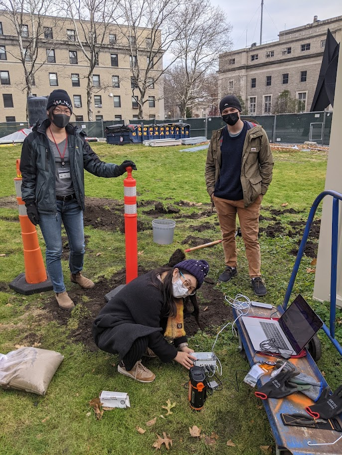

<!---
## Hilary Chang
You can use the [editor on GitHub](https://github.com/HilaryCh/hilarych.github.io/edit/master/README.md) to maintain and preview the content for your website in Markdown files.
Whenever you commit to this repository, GitHub Pages will run [Jekyll](https://jekyllrb.com/) to rebuild the pages in your site, from the content in your Markdown files.
### Markdown
Markdown is a lightweight and easy-to-use syntax for styling your writing. It includes conventions for
```markdown
Syntax highlighted code block
# Header 1
## Header 2
### Header 3
- Bulleted
- List
1. Numbered
2. List
**Bold** and _Italic_ and `Code` text
[Link](url) and 
```
For more details see [GitHub Flavored Markdown](https://guides.github.com/features/mastering-markdown/).
### Jekyll Themes
Your Pages site will use the layout and styles from the Jekyll theme you have selected in your [repository settings](https://github.com/HilaryCh/hilarych.github.io/settings). The name of this theme is saved in the Jekyll `_config.yml` configuration file.
### Support or Contact
Having trouble with Pages? Check out our [documentation](https://help.github.com/categories/github-pages-basics/) or [contact support](https://github.com/contact) and we’ll help you sort it out.
--->


## About Me

I am a 6th-year PhD student studying geophysics and seismology at Massachusetts Institute of Technology.

My research interests are

- Source characterization for small to moderate earthquakes.
-	Near-surface structure (Fig. 1,2).
-	Ambient noise seismology.
-	Fiber-optic seismology (Fig. 3).
-	Applications in reservoir and fault monitoring, geothermal exploration, and carbon storage.

In my free time, I like paddling (Fig. 4), sailing on the Charles River, and rollerblading along the riverside.


<figure>

<figcaption>Fig 1. Testing the Blackberry Shake on campus (left to right: myself, Ayako Tsuchiyama, Jared Bryan). Picture credit: William Frank. </figcaption>
</figure>

<figure>

<figcaption>Fig 2. Performing a geophone survey on campus (left to right: Denzel Segbefia, myself). Picture credit: Congcong Yuan.</figcaption>
</figure>

<figure>

<figcaption>Fig 3. Conducting a seismic experiment using the telecom cables on campus (left to right: myself, John A. Morgante). Picture credit: Agatha Podrasky.</figcaption>
</figure>

<figure>

<figcaption>Fig 4. Waiting for the geese to cross the river.</figcaption>
</figure>

## Education

- PhD candidate, Geophysics, Massachusetts Institute of Technology, 2019 - present
- BSc, Earth Sciences, Memorial University of Newfoundland, 2019
- BBA, Finance, National Taiwan University, 2009

  [[My CV]](./doc/CV_ChangH.pdf) [[Google Scholar]](https://scholar.google.com/citations?user=2VgGh4gAAAAJ&hl=en&oi=ao)

## Research
(Feel free to email me if you would like to gain access to the papers!)

Chang, H., Qiu, H., Zhang, Z., Nakata, N., & Abercrombie, R. E. (2025). Investigation of site amplifications using ambient-noise-derived shallow velocity structures under a dense array in Oklahoma. Bulletin of the Seismological Society of America 2025; doi: [10.1785/0120240074](https://doi.org/10.1785/0120240074)

Nakata, N., Chang, H., Wu, S.M., Zhengfa Bi, Chen, L.W., Soom, F., Gao, H., Titov, A., & Dadi, S. (2025). Fracture characterization revealed by microseismicity at Cape Modern Geothermal Field, Utah. Proceedings of the 50st Stanford Geothermal Workshop. [[Link]](https://pangea.stanford.edu/ERE/db/IGAstandard/record_detail.php?id=38079)

Chang, H., Abercrombie, R. E., & Nakata, N. (2025). Importance of considering near-surface attenuation in earthquake source parameter estimation: Insights from Kappa at a dense array in Oklahoma. Bulletin of the Seismological Society of America 2025; doi: [10.1785/0120240137](https://doi.org/10.1785/0120240137) [[AGU Poster]](https://doi.org/10.22541/essoar.173557447.71449637/v1) 
<!---
[[PDF]](./doc/bssa-2024137.1_accepted.pdf)
[[Supplement PDF]](./doc/bssa-2024137_accepted_supplement.pdf)
--->

Chang, H, Nakata, N., Abercrombie, R.E, Dadi, S. and Titov, T. (Dec 2024). Toward reliable estimation of source parameters using Distributed Acoustic Sensing for microearthquakes in the Cape Modern geothermal field, Utah. Poster presentation at the AGU Fall Annual Meeting, Washington, DC, USA. [[Poster]](https://doi.org/10.22541/essoar.173463098.87413304/v1)

Chang, H., & Nakata, N. (2024). Urban site characterization using DAS dark fibers on the MIT campus in Cambridge, Massachusetts. The Leading Edge, 43 (11): 747–756. [[PDF]](./doc/4311_TSS_Chang.pdf) [[Journal]](https://doi.org/10.1190/tle43110747.1) [[AGU Poster]](https://doi.org/10.22541/essoar.173557430.00011437/v1)

Chang, H., Abercrombie, R. E., Nakata, N., Pennington, C. N., Kemna, K. B., Cochran, E. S., & Harrington, R. M. (2023). Quantifying site effects and their influence on earthquake source parameter estimations using a dense array in Oklahoma. Journal of Geophysical Research: Solid Earth, 128(9), e2023JB027144. [[Link]](https://doi.org/10.1029/2023JB027144)

O’Ghaffari, H., Peč, M., Mittal, T., Mok, U., Chang, H., & Evans, B. (2023). Microscopic defect dynamics during a brittle-to-ductile transition. Proceedings of the National Academy of Sciences, 120(42), e2305667120. [[Link]](https://doi.org/10.1073/pnas.2305667120)

White, M. C., Zhang, Z., Bai, T., Qiu, H., Chang, H., & Nakata, N. (2023). HDF5eis: A storage and input/output solution for big multidimensional time series data from environmental sensors. Geophysics, 88(3), F29-F38. [[Link]](https://doi.org/10.1190/geo2022-0448.1)

Chang, H., & Nakata, N. (2022). Investigation of time-lapse changes with DAS borehole data at the Brady Geothermal Field using deconvolution interferometry. Remote Sensing, 14(1), 185. [[Link]](https://doi.org/10.3390/rs14010185)

Pennington, C. N., Chang, H., Rubinstein, J. L., Abercrombie, R. E., Nakata, N., Uchide, T., & Cochran, E. S. (2022). Quantifying the sensitivity of microearthquake slip inversions to station distribution using a dense nodal array. Bulletin of the Seismological Society of America, 112(3), 1252-1270. [[Link]](https://doi.org/10.1785/0120210279)

Chang, H., Malcolm, A., Massin, F., and Grigoli, F. (Feb/Apr/May 2019). Automatic earthquake locating using characteristic functions in a source scanning method. Oral presentation at the GACNL Annual Technical Meeting, St John’s, NL, Canada (February); poster presentation at the EGU General Assembly, Vienna, Austria (April); invited poster presentation at the JpGU Annual Meeting, Chiba, Japan. [[Poster]](./doc/EGU_2019poster_HC_1(CC-BY).pdf)


